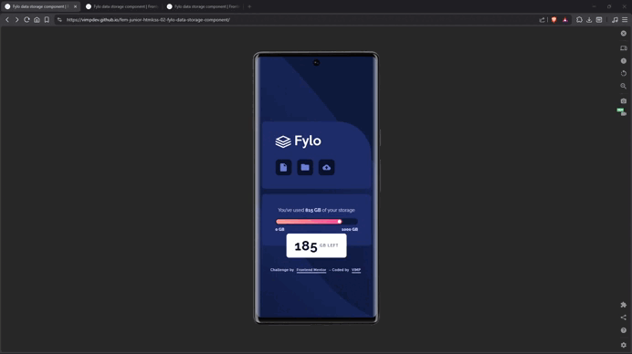

# 🚀 Fylo data storage component – Frontend Mentor

A responsive data storage component built with semantic HTML and modern CSS, focused on accessibility, layout precision, and clean architecture.

This is a solution to the [Fylo data storage component challenge on Frontend Mentor](https://www.frontendmentor.io/challenges/fylo-data-storage-component-1dZPRbV5n).

---

## 🔗 Links

- 🌎 [Live site](https://vimpdev.github.io/fem-junior-htmlcss-02-fylo-data-storage-component/)
<!-- - 📌 [Frontend Mentor Solution]() -->

---

## 🎬 Demo

---

## 📸 Screenshots

| 📱 Mobile | 📲 Tablet | 🖥️ Desktop |
| --- | --- | --- |
|  |  |  |

--- 

## 🎯 Features

- Responsive layout (mobile-first)
- Custom progress bar with gradient fill
- Accessible markup using ARIA attributes
- Tooltip-style remaining storage indicator

---

## 🛠️ Built with

- Semantic HTML5
- Modern CSS (custom properties, Flexbox)
- Mobile-first workflow

---

## 🧠 What I learned

- How to build an accessible progress bar using `role="progressbar"` and ARIA attributes
- Managing layout constraints using `clamp()` and responsive techniques
- Structuring CSS with reusable tokens and consistent naming (BEM-inspired)
- Creating UI details like tooltips and custom indicators purely with CSS

---

## 🤖 AI Collaboration

AI tools were used to support development tasks such as:

- Reviewing code structure and accessibility
- Refining semantic HTML and naming conventions
- Improving CSS architecture and best practices

---

## 👨‍💻 Author

- Frontend Mentor – [@vimpdev](https://www.frontendmentor.io/profile/vimpdev)

---

## 🙌 Acknowledgments

Challenge by Frontend Mentor.

---